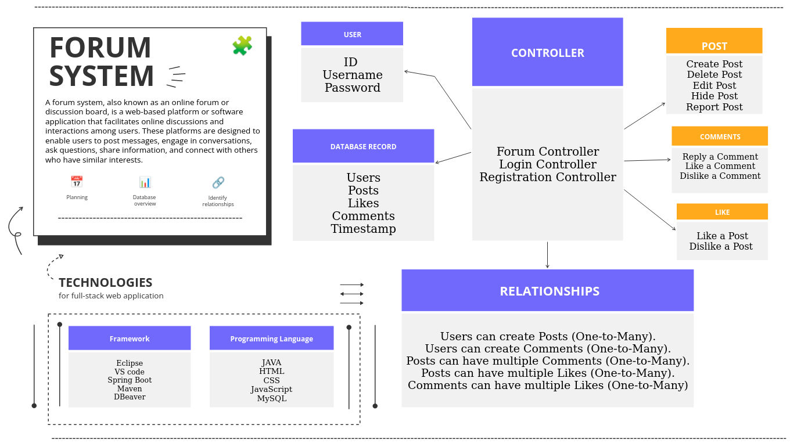

# Forum System

## Introduction

The Forum System is a web-based platform designed to facilitate discussions and interactions among users.
Its primary purpose is to provide a space for users to share their thoughts, ideas, and questions on various topics. 
Key features include user registration, posting content, liking posts and comments, commenting on posts, and a notification system to keep users engaged.

## System Components

- **Front-end:** The user interface through which users interact with the forum, including web pages for posting, commenting, and viewing content. We have used HTML, CSS, and JavaScript.

- **Back-end:** The server-side logic that handles user requests, manages the database, and enforces security and business rules using Java. We have used Spring Boot, Maven, Eclipse, and Visual Studio Code.

- **Database:** Stores user data, posts, comments, likes, and other relevant information. We have used MySQL with DBeaver.

## User Management

- **User Registration:** Users can sign up by providing essential information such as username, email, and password. Implement email verification to confirm the user's identity.

- **User Profiles:** Store user profiles in the database, including user-specific data like profile pictures, bios, and user statistics (e.g., posts, likes, comments). Users can view and edit their profiles, updating information as needed.

## System Controller

- **Posts:** In the context of the forum application, users have the capability to create posts with titles, body text, and relevant tags, facilitated by rich text editors. Posts encompass title, content, timestamps, and author usernames, offering formatting options for users. Editing and deletion of posts are supported, with defined permissions and rules.

- **Likes:** Users can express appreciation or agreement by liking posts, with restrictions to a single like per user. The application displays the number of likes and usernames of those who liked a post.

- **Comments:** Commenting on posts is enabled, featuring comment text, timestamps, and commenter usernames. Users can edit and delete their comments, with moderation rules in place. Liking comments to show support is also a feature, with analogous display and notification functionalities as post likes.

## Liking a Comment
Users have the ability to express their appreciation or agreement with a comment by "liking" it. This feature promotes interaction and engagement within the forum system. Here's how liking a comment is implemented:

 - **Liking a Comment:** Users can like a comment by clicking on a "Like" button associated with each comment. This action signifies their support or agreement with the comment.

 - **Single Like per User:** To maintain the integrity of the liking system, each user is allowed to like a particular comment only once. Attempting to like the same comment multiple times will not increase the like count.
  
- **Display of Likes:** The forum system displays the number of likes that a comment has received. Users can see how many other users have liked a particular comment.

 - **Usernames of Likers:** Alongside the like count, the system also displays the usernames of users who have liked a comment. This transparency allows users to see who else agrees with or appreciates a specific comment.

